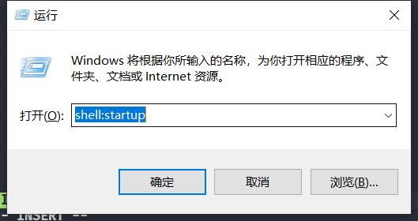

# 介绍

一个用于登录泥电校园网的脚本，支持电信和移动。

# 下载

可在[发布页面](https://github.com/kewuaa/uestc_wifi_helper/releases)下载可执行文件。（版本需要高于Windows 10 1903）

# 使用方法

首次运行会提示需要配置，配置文件默认如下：

``` toml
username = "your username"

password = "your password"

# network operator of your wifi
# 电信: dx
# 移动: cmcc
# 默认为电信
network_operator = "dx"

# 间隔多长时间检查一次网络
# 单位为秒，整数
# 设置为非正数时相当于单独检查一次网络
# 默认为 30，即每隔 30 秒自动检查一次网络
check_interval = 30
```

可通过`win+r`打开Windows命令运行框，并输入`shell:startup`，打开开机自启动目录，放入可执行文件的快捷方式，进而实现开机自启动


